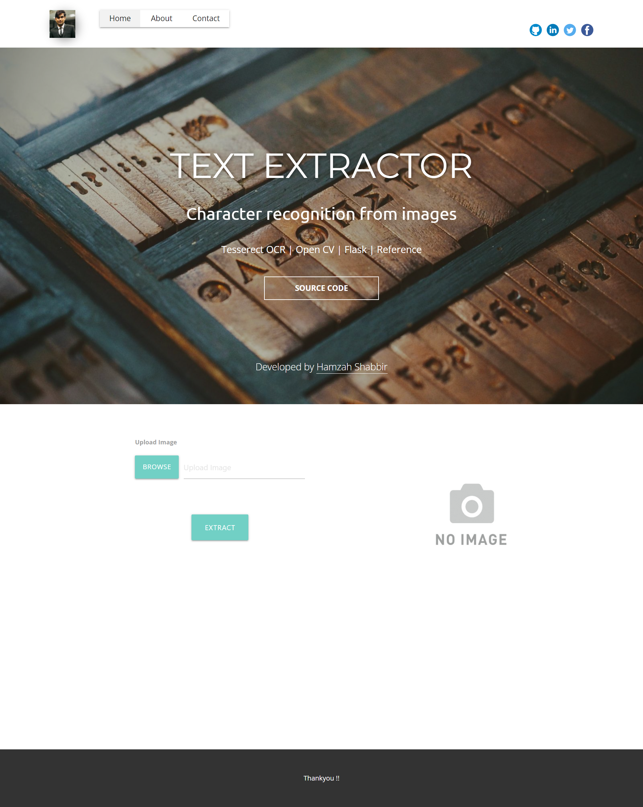

[](https://youtu.be/OZ6BEFHHsrE)


    
# Application of character recognition to extract text from images using Tesserect and openCV

Objective of this application was to create a web app that can extract character from images. In recent years with advancement in computation and data processing, deep learning has taken a huge popularity. One of the applications of neural network can be to process image and train image to localize and even extract text out of image. With the conversion of images in array, it is possible to make computation and training over images followed by text localization, character segmentation and eventually character recognition.

# Approach of project
In the backend along with the processing and image conversion, Tesserect software has been used. Tesseract is an optical character recognition engine for various operating systems. It is free software, released under the Apache License. It uses EAST (efficient, accurate scene text detector) deep learning algorithm for text detection. It can find horizontal and rotated bounding boxes. It can be used in combination with any text recognition method.In the backend along with the processing and image conversion, Tesserect software has been used. Tesseract is an optical character recognition engine for various operating systems. It is free software, released under the Apache License. It uses EAST (efficient, accurate scene text detector) deep learning algorithm for text detection. It can find horizontal and rotated bounding boxes. It can be used in combination with any text recognition method. 

# EAST (efficient, accurate scene text detector) algorithm
This is a very robust deep learning method for predictive text based on this paper. It's worth noting because it's just a text recognition method. It can find horizontal and rotated bounding boxes. It can be used in combination with any text recognition method. The fully folded network is used to generate a prediction on word or line level directly. The generated predictions, which could be rotated rectangles or squares, are further processed by the non-maximal suppression step to obtain the final output.

## Installation

1.	Install tesseract-ocr [from](https://github.com/tesseract-ocr/tessdoc) and add to environment variable 
2.	Create virtual environment and activate it

```pip install virtualenv
   virtualenv mypython
   mypthon\Scripts\activate

```
3. Install requirement from requirements.txt
```pip install -r requirements.txt

```
4. Open 'views.py' and add following lines of code-
```pytesseract.pytesseract.tesseract_cmd = r'C:\Program Files\Tesseract-OCR\tesseract.exe'

```
5. Open 'views.py' and set language to 'eng' for english.
```language='eng'

```



## Authors

- [@hamzahshabbir](https://www.linkedin.com/in/hamzah-shabbir-108765a5/)

  
## Acknowledgements

 - [Tesserect](https://github.com/tesseract-ocr/tesseract)
 - [Natural Language Toolkit](https://www.nltk.org/)
 - [Flask](https://flask.palletsprojects.com/en/2.0.x/)

  
https://github.com/hamzahshabbir96/natural-language-genre-prediction/issues/1#issue-1059243551

## References

 - [Tesserect github](https://github.com/tesseract-ocr/tesseract)
 - [Google group](https://groups.google.com/g/tesseract-ocr?pli=1/)
 - [Pyimage serach](https://www.pyimagesearch.com/2020/05/25/tesseract-ocr-text-localization-and-detection/)


  
## Feedback

If you have any feedback, please reach out to me at hamzahshabbir7@gmail.com

  
## 🔗 Links
[](https://www.linkedin.com/in/hamzah-shabbir-108765a5/)

  

